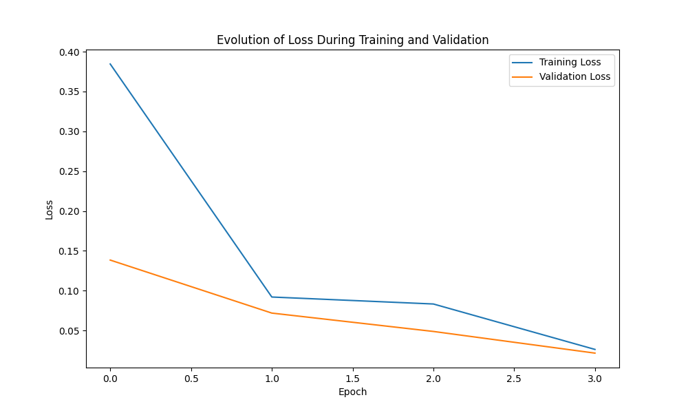

# GenderTermicHandsRecognition Model

## Overview

This model is a machine learning tool designed to recognize and classify the gender of individuals based on thermal images of their hands. Utilizing the powerful VGG16 architecture pre-trained on ImageNet, the model has been fine-tuned to classify two genders, designated in the dataset as 'Home' (presumably male) and 'Dona' (presumably female).

## Dataset

The dataset consists of thermal hand images from two separate directories, `TermicPalm/Termica` and `TermicDors/Termica`. These images are labeled with gender information contained within an annotation file `sexes.txt`. Each individual's images have been captured, with the dataset including up to ten images per person.

## Transformation and Preprocessing

Images are resized to 224x224 pixels, converted to tensor, and normalized with mean values of `[0.485, 0.456, 0.406]` and standard deviations of `[0.229, 0.224, 0.225]` to match the preprocessing of the VGG16 network.

## Model Architecture

The model is built on the VGG16 network, with the final classification layer adapted to output two classes. It is trained using the Adam optimizer with a learning rate of `0.0001` and a CrossEntropy loss function, suitable for multi-class classification tasks.

## Training Procedure

The dataset is split into training (80%) and testing (20%) subsets. The model is trained over four epochs with a batch size of 32, and both training and validation losses are monitored to assess the performance and detect any overfitting.

## Evaluation

The model's performance is evaluated using a confusion matrix and various metrics, including accuracy, precision, recall, and F1-score. These metrics provide a comprehensive understanding of how well the model is performing on the test dataset.

## Results

From the provided confusion matrix and sample prediction images, it is evident that the model has achieved a high degree of accuracy. The loss plots indicate that both the training and validation losses decrease over time, suggesting that the model is learning effectively without overfitting significantly.

## Conclusion

The GenderTermicHandsRecognition model demonstrates the capability of using thermal imaging for gender classification. The successful application of transfer learning via the VGG16 model illustrates the potential of deep learning in unconventional image processing tasks.

